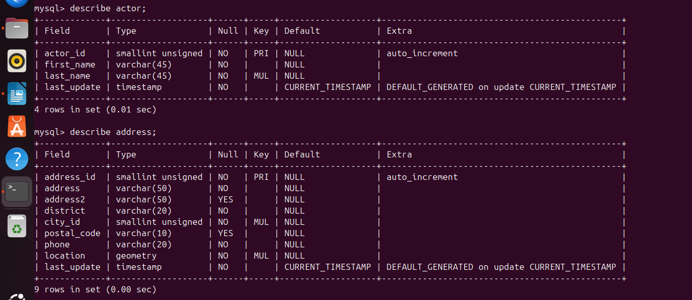

# Домашнее задание к занятию "Работа с данными (DDL/DML)" - Tarkov Viktor


### Инструкция по выполнению домашнего задания

   1. Сделайте `fork` данного репозитория к себе в Github и переименуйте его по названию или номеру занятия, например, https://github.com/имя-вашего-репозитория/git-hw или  https://github.com/имя-вашего-репозитория/7-1-ansible-hw).
   2. Выполните клонирование данного репозитория к себе на ПК с помощью команды `git clone`.
   3. Выполните домашнее задание и заполните у себя локально этот файл README.md:
      - впишите вверху название занятия и вашу фамилию и имя
      - в каждом задании добавьте решение в требуемом виде (текст/код/скриншоты/ссылка)
      - для корректного добавления скриншотов воспользуйтесь [инструкцией "Как вставить скриншот в шаблон с решением](https://github.com/netology-code/sys-pattern-homework/blob/main/screen-instruction.md)
      - при оформлении используйте возможности языка разметки md (коротко об этом можно посмотреть в [инструкции  по MarkDown](https://github.com/netology-code/sys-pattern-homework/blob/main/md-instruction.md))
   4. После завершения работы над домашним заданием сделайте коммит (`git commit -m "comment"`) и отправьте его на Github (`git push origin`);
   5. Для проверки домашнего задания преподавателем в личном кабинете прикрепите и отправьте ссылку на решение в виде md-файла в вашем Github.
   6. Любые вопросы по выполнению заданий спрашивайте в чате учебной группы и/или в разделе “Вопросы по заданию” в личном кабинете.
   
Желаем успехов в выполнении домашнего задания!
   
### Дополнительные материалы, которые могут быть полезны для выполнения задания

1. [Руководство по оформлению Markdown файлов](https://gist.github.com/Jekins/2bf2d0638163f1294637#Code)

---

Задание можно выполнить как в любом IDE, так и в командной строке.

### Задание 1

1.1. Поднимите чистый инстанс MySQL версии 8.0+. Можно использовать локальный сервер или контейнер Docker.

```python
sudo apt install mysql-server mysql-client
sudo systemctl status mysql
sudo systemctl enable mysql
sudo mysqladmin password -u root -p
sudo mysql_secure_installation
sudo mysql -u root -p
```


1.2. Создайте учётную запись sys_temp.

```python
CREATE USER 'sys_temp'@'localhost' IDENTIFIED BY 'sql';
```


1.3. Выполните запрос на получение списка пользователей в базе данных. (скриншот)

```python
select user from mysql.user;
```


1.4. Дайте все права для пользователя sys_temp.

```python
GRANT ALL PRIVILEGES ON *.* TO 'sys_temp'@'localhost' WITH GRANT OPTION;
```


1.5. Выполните запрос на получение списка прав для пользователя sys_temp. (скриншот)

```python
show grants for 'sys_temp'@'localhost';
```


1.6. Переподключитесь к базе данных от имени sys_temp.

Для смены типа аутентификации с sha2 используйте запрос:
```python
ALTER USER 'sys_test'@'localhost' IDENTIFIED WITH mysql_native_password BY 'password';
```

```python
SYSTEM mysql -u sys_temp -p
SELECT user();
```


1.7. По ссылке https://downloads.mysql.com/docs/sakila-db.zip скачайте дамп базы данных.

```python
wget https://downloads.mysql.com/docs/sakila-db.zip
unzip sakila-db.zip
ls
cd sakila-db
```


1.8. Восстановите дамп в базу данных.

```python
sudo mysql -u sys_temp -p  
CREATE DATABASE sakila;
show databases;
USE sakila;
show tables;
source sakila-schema.sql;
source sakila-data.sql;
```


1.9. При работе в IDE сформируйте ER-диаграмму получившейся базы данных. При работе в командной строке используйте команду для получения всех таблиц базы данных. (скриншот)

*Результатом работы должны быть скриншоты обозначенных заданий, а также простыня со всеми запросами.*

```python
show tables;
```


---

### Задание 2

Составьте таблицу, используя любой текстовый редактор или Excel, в которой должно быть два столбца: в первом должны быть названия таблиц восстановленной базы, во втором названия первичных ключей этих таблиц. Пример: (скриншот/текст)

```python
Название таблицы | Название первичного ключа
customer         | customer_id
```

  

[Файл таблицы](https://github.com/stimul2520/ddl-dml/blob/ff615687a48d50118e0702f2c32d7cc5ed2a3b99/img/3000.txt)

```python
sudo mysql -u sys_temp -p
USE sakila;
show tables;
describe actor or ...next line;
SELECT TABLE_NAME, COLUMN_NAME FROM information_schema.KEY_COLUMN_USAGE WHERE table_schema = 'sakila' AND CONSTRAINT_NAME = 'PRIMARY';
``` 

---

